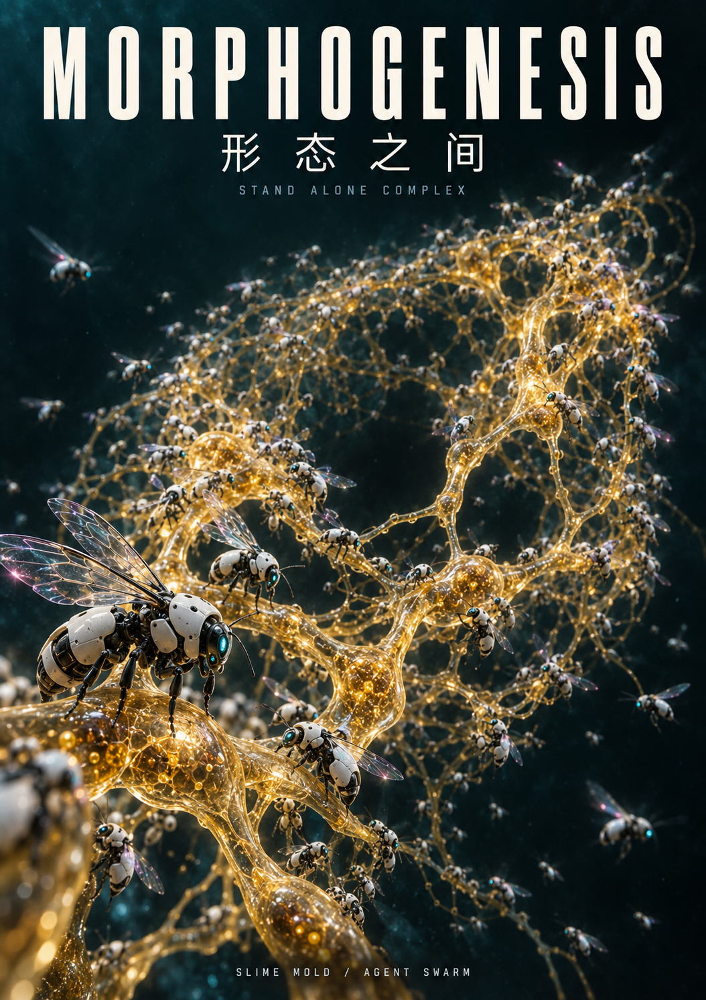
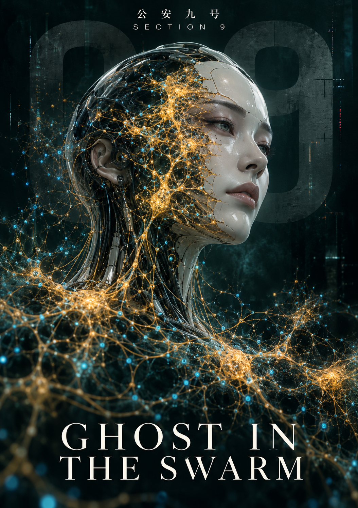

# Morphogenesis：形态发生——Ghost in the Swarm

## 一、要解决的问题

当前多智能体系统存在两个结构性缺陷。其一是中心化脆弱：无论框架形态如何变化，系统中心总有一个调度器决定任务分配与执行次序；调度器存活则系统存活，调度器失效则群体停摆，且所有协调流量经过单点，形成信息瓶颈。其二是经验孤岛：各 Agent 的经验锁定在各自的上下文窗口内，一个成员踩过的坑，另一个成员原样重踩；任务结束后经验随会话消散，群体规模的增长并不带来能力的增长。

Morphogenesis 对这两个缺陷给出同一个回答：把协调与记忆都交给环境。

## 二、理念：形态发生与 Ghost in the Swarm

项目名取自图灵 1952 年的论文《形态发生的化学基础》。图灵证明：对称均匀的初始状态，在局部反应—扩散规则的作用下会自发破缺出稳定结构——秩序不需要总设计师，只需要局部规则与足够的时间。这正是本项目追求的系统性质。

生物学原型是多头绒泡菌。2000 年 Nakagaki 在 Nature 发表的实验显示，单细胞黏菌能在迷宫中找到两处食物源之间的最短路径；2010 年 Tero 团队在 Science 上进一步证明，将食物点按东京都市圈地理摆放，黏菌长出的营养输送网络与关东铁路网高度一致。一个没有大脑的细胞解出了图论与网络规划问题，其原理只有一条：流量塑造管道，管道引导流量。

协调机制的学名是 stigmergy：白蚁筑巢没有总图纸，每只白蚁仅依据其他白蚁留下的痕迹行动，复杂结构从痕迹的累积中涌现。

主题层的致敬来自《攻壳机动队》。公安九课的世界里，义体可以更换、记忆可以改写，唯一不可复制的是个体的 Ghost；素子在故事终点选择融入网络，个体边界溶解而意志延续。本项目的对应命题是：每个 Agent 的经验印记是其个体的 Ghost，当印记在共享环境中相互塑造、彼此继承，蜂群便生长出自己的 Ghost in the Swarm——没有成员拥有全局视野，但群体记住了所有成员的成败。

## 三、系统架构与算法



系统经历两代演进，两代代码均以完整证据链存档。

第一代，已归档，为中心化编排下的五机制闭环，包含拓扑生长、经验代谢、权重选路、接续与复核、可视化模块。它验证了机制的生物学自洽逻辑，但仍然保留中心调度器，存在传统多智能体系统的单点瓶颈问题。

第二代，当前迭代版本，为完全去中心化蜂群架构，包含七大核心模块，分别是本地资产库、任务账本、局部路由、写权租约、Worker 自主循环、预算代理、观察者与 Hub 镜像。系统准确定位为同机多进程、可信 Worker、共享持久化环境、无常驻任务派发者的自主协作系统。项目彻底消除了中心化派发节点，基于本地环境完成全部协作闭环，不做跨机器去中心化的虚设宣传，工程边界诚实且清晰。

项目核心算法设计具备完整独创性与工程优化逻辑。

经验代谢采用读时衰减机制，每条经验仅存储时间戳与固定半衰期参数，标准时长为八万六千四百秒，权重数值在读取瞬间通过指数公式动态计算更新。经验不会主动写回修改，仅在被调用时完成动态刷新，彻底消除了传统信息素模型持续写回带来的性能损耗，同时规避了多 Worker 并发场景下的共享场污染问题。

任务账本严格遵循事实与偏好分离原则，任务身份、运行状态、依赖关系、尝试次数为永久留存、不衰减的客观事实；仅路由策略、执行偏好、路径优先级具备时间衰减特性。系统仅弱化低效策略路径的权重，不会抹除任务本体记录，所有审计日志永久留存，实现可追溯、可复盘的群体协作。

任务选路摒弃传统贪心最优策略，采用 softmax 加权抽样算法。系统不会让所有 Agent 扎堆涌向当前最优路径，保留群体并行探索能力，兼顾执行效率与探索创新。每一次路由选择的信号参数、约束条件、权重数值、抽样概率全程留痕，实现全链路可审计。

资源写权由租约机制统一裁决，结合原子认领、TTL 超时回收、防并发令牌三重机制保障安全。Worker 暂停重启后，过期操作票据会被系统识别拒绝，避免旧数据覆盖新成果；未完成任务支持主动移交，预算资源随任务同步转移，保障协作连续性。

系统资源消耗遵循先预留、后执行、再结算的安全逻辑，未知开销场景自动触发熔断保护，杜绝无上限资源消耗。在追求自主协作的同时，将系统安全作为第一约束条件。

本项目保持严谨的学术谱系诚实性，黏菌管道连续动力系统经过工程离散化改造，不直接套用原始论文收敛性结论，明确区分理论模型与工程落地差异；信息素迭代逻辑溯源蚁群优化经典研究，在成熟理论基础上完成创新改造。

## 四、工程证据与验收纪律

项目建立独立完整的六层验收门禁体系，从 G0 至 G5 分层校验系统能力，所有运行状态、测试数据、迭代记录全部真实留存。其中机制设计、单元测试、功能验证模块全部通过验收；资源预算模块受上游接口限制，通过参数约束、超时熔断、事后审计三层兜底机制降级保障，完整留存真实用量记录。

外部生态对接模块已完成资产发布，三项可复用智能体资产成功同步至 EvoMap Hub，受生态积分门禁管控，真实保留迭代未完善状态，不做虚假功能宣称。现场落地验收为待执行迭代项，预留后续优化空间。

项目具备完备工程量化证据，第一代归档版本完成二百九十四项测试全覆盖、五十五个文件严格类型校验，双平台持续集成测试全绿通过。第二代去中心化迭代版本，Windows 平台四百九十一项测试、Ubuntu 平台四百九十项测试全部通过，双平台 CI 验证稳定可靠。中心化旧架构已标签归档冻结，主线功能与演示部署完全不受新版本迭代影响，版本管理规范严谨。

## 五、与 EvoMap 的关系

本项目与 EvoMap 生态为互补共生关系，不存在功能竞争与赛道重合。EvoMap 主打跨设备、跨主体的全局经验网络，通过 Hub 托管智能体基因与能力胶囊，依靠量化评分机制完成能力晋级，以贡献者经济驱动全局经验流通，解决多主体跨生态的经验交换问题。

Morphogenesis 主打单机本地自治蜂群，智能体验证、能力晋级、经验复用全部在本地完成闭环，EvoMap Hub 仅作为可选外部资源来源。网络在线状态下，系统可镜像同步资产，获取生态流量与外部能力补充；离线状态下，本地蜂群可独立运行、自主迭代、自我生长，完全不依赖外部中心化服务。

二者核心定位可精准概括：EvoMap 实现百万级智能体共享单一个体的学习成果，打通全局经验流通；Morphogenesis 实现本地蜂群无中心自主进化，让集群在零外部依赖场景下自主生长、自主学习、自主迭代。本项目深度适配 EvoMap 官方模型网关，属于生态内生创新项目，而非独立竞品系统。

## 六、应用前景

本系统核心内核适配任务可拆分、经验可复用、成本可管控的各类长时程复杂场景，可落地于自动化数据流水线自愈运维、多代码仓库批量巡检与缺陷修复、智能体悬赏市场自主接单执行等场景。

系统可无缝接入 EvoMap 生态交易市场，本地蜂群可自主认领平台悬赏任务、自主拆解执行、自主沉淀复用资产，通过持续任务迭代积累优质智能体能力资产，同时以贡献者经济反哺生态，形成正向循环的智能体进化体系。

项目制定严格统一的经验继承验收标准，单个智能体验证通过的有效资产，可被其他智能体复用迭代，全程留存资产编号、上下文输入、执行日志、复用记录，精准区分无效资产堆积与真实经验驱动的能力增长，保障群体智能持续正向进化。

## 七、使用入口

所有命令收敛到统一控制台脚本 `morphogenesis`（等价 `python -m bootstrap`）。先安装锁定环境：

```powershell
$env:POETRY_VIRTUALENVS_IN_PROJECT = 'true'
uv tool run poetry install
npm ci --ignore-scripts
```

| 子命令 | 用途 |
|---|---|
| `morphogenesis check` | 本地质量门：全量 pytest + strict mypy |
| `morphogenesis prepare --workspace <dir>` | 生成固定练习 workspace（不执行模型） |
| `morphogenesis verify --workspace <dir>` | 独立固定验证器复核 |
| `morphogenesis acceptance ...` | 单次真实模型运行闭环（转发 `python -m orchestration.acceptance`） |
| `morphogenesis rehearsal ...` | 两项已授权新任务固定彩排（转发 `python -m orchestration.rehearsal`） |
| `morphogenesis serve ...` | 只读本地 dashboard（转发 `python -m viz.server`） |
| `morphogenesis swarm` | 占位：异构蜂群尚未合入主线 |

转发子命令把剩余参数原样交给对应模块，其 `--help`、退出码、阻塞服务与信号处理与 `python -m ...` 完全一致；先看 `morphogenesis <subcommand> --help`。`contract_local`、`interface_live`、`task_live` 相互独立，未知 usage 为 `null`，绝不臆造为零。现场演示见 `demo/run-demo.ps1`，公网部署见 `deploy/README.md`。

## 八、结语



在《攻壳机动队》的叙事中，素子融入网络，是个体边界的消融，亦是更高维度意志的延续。本项目的设计内核亦是如此，彻底打破传统智能体等待指令、被动执行的运行模式，摆脱中心化调度器的桎梏。

当个体经验可以沉淀为群体资产，当协作路径由真实执行反馈自然塑形，当无数独立智能体的个体意志汇聚为集群的整体智能，蜂群便拥有了属于自己的群体意志。

Morphogenesis 所构建的不仅是一套自动化协作系统，更是一套无中心、自生长、可进化、可传承的原生群体智能形态。形态发生一旦启动，群体智能的进化便会自主持续，无需人工持续干预，实现真正意义上的自主生长式智能蜂群。
