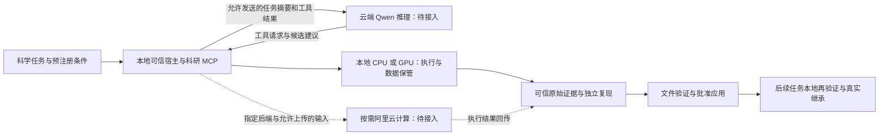

# Morphogenesis · Qwen / 阿里云 / 科研提效

**科学任务 → 实验执行 → 独立复现 → 真实成果继承。** Morphogenesis 将任务、实验条件和验证结果保存在可复核的环境中，让后续任务本地重新验证、实际应用已有成果，再记录 adoption。

产品方向是云端 Qwen 推理与本地 CPU/GPU 数据计算协同，本机资源不足时按需使用阿里云算力。目标是减少重复实验准备和无效经验复用；加速收益需要实际测量。

## 云端与本地如何分工

下面是目标数据流，Qwen 接入与云计算后端均尚未运行：


```mermaid
flowchart LR
    T[科学任务与预注册条件] --> H[本地可信宿主与科研 MCP]
    H -->|允许发送的任务摘要和工具结果| Q[云端 Qwen 推理：待接入]
    Q -->|工具请求与候选建议| H
    H --> L[本地 CPU 或 GPU：执行与数据保管]
    H -.指定后端与允许上传的输入.-> C[按需阿里云计算：待接入]
    L --> E[可信原始证据与独立复现]
    C -.执行结果回传.-> E
    E --> V[文件验证与批准应用]
    V --> A[后续任务本地再验证与真实继承]
```

| 层 | 职责 | 当前边界 |
|---|---|---|
| Qwen / 阿里云百炼 | 理解任务、提出工具调用、分析允许发送的证据摘要 | 接入目标，NOT_RUN；云推理不等于实验执行 |
| 本地计算与可信宿主 | 保管原始数据、裁决权限和租约、执行与读取证据 | 冻结科研版本完成 CPU 案例；GPU 科研未运行 |
| 指定阿里云计算后端 | 本机资源不足时执行已批准的计算任务 | NOT_RUN；未实现跨机器调度或测得加速 |

原始数据默认留在本地。云端只接收操作者允许的必要摘要；模型不能直接写权威账本、批准结果或获取计算凭据。具体接口、资源与验收见 [Qwen / 阿里云科研协同路线](docs/QWEN_ALIYUN_RESEARCH.md)。

## 已完成的科学证据与当前 main

独立冻结科研版本完成 NIST NumAcc4 与项目自有七行 synthetic 线性回归两案例：每类两个原生 CLI 品牌、三个不同角色会话、三个真实 CPU 实验。独立复现后验证文件、批准应用，再由第三角色本地再验证并真实继承。两个完整检查器首次通过，三角色当前 token 有效续租通过，两例各有唯一 AdoptionReceipt。

证据来自 Codex 与 Claude CLI；Claude 实际使用 StepFun 模型。**它不是 Qwen 实测。** 本轮 main 更新只修改文档，没有合入这些冻结科研版本的代码或独立产品。

| 冻结身份 | 固定远端内容 |
|---|---|
| CORE `bf67c1a4134a25d009cff2acccbfab027999bea6` | [科研执行核心](https://github.com/songconmaisaix31-design/Morphogenesis/tree/bf67c1a4134a25d009cff2acccbfab027999bea6) |
| PRODUCT `dfbc88cbc5fb90f41f6ba01a0f5d16a5a59294fa` | 源码位于私有独立产品仓库 `songconmaisaix31-design/Morphogenesis-Research`；需要仓库访问权限，由有权限的审查者按此完整 SOURCE 核对。公共验收入口见下行 REPORT |
| REPORT `7b66f0dd0a285c1b6cf789aa3c5a41d22d655993` | [公开完整双案例验收、命令、首失败与限制](https://github.com/songconmaisaix31-design/Morphogenesis/blob/7b66f0dd0a285c1b6cf789aa3c5a41d22d655993/docs/tracks/research-integration-cases-1002.md) |

冻结 CORE 完整双平台工程门禁通过：Windows 1154 passed / 5 skipped，Linux 1153 passed / 6 skipped，类型检查、构建、SDK 与实际 wheel 分发检查通过。这些结果属于精确冻结版本，不能当作当前 main 或未来 Qwen 版本的验收。

`contract_local`、`interface_live`、`task_live` 分别记录。Mock、检索、注入、退出码 0 不能单独证明科学通过或真实采用；未知远端效果停止重试，未知费用保留 `null`。

## 使用当前 main

Python 3.12–3.13；Node.js 至少 22.13。保持本源码 checkout，按提交的锁安装依赖：

```powershell
uv tool run poetry install
npm ci --ignore-scripts
uv tool run poetry run python -m bootstrap --help
uv tool run poetry run python -m swarm --help
```

| 当前入口 | 实际用途 |
|---|---|
| `python -m bootstrap` / `morphogenesis` | [统一控制台](bootstrap/cli.py)：prepare、verify、check、acceptance、rehearsal、serve |
| `morphogenesis swarm` | 当前仍为占位，退出 2；不能用于启动科研产品 |
| `python -m swarm` / `morphogenesis-swarm` | [独立 swarm CLI](swarm/cli.py)：observe、seed-demo、demo、worker；fixture 演示不是科研 live |
| 独立仓库的 `morph-research` | 固定版本正式科研入口：init、inspect、run、observe、audit；不由此 main 安装提供 |

本地固定练习无需模型调用：

```powershell
uv tool run poetry run python -m bootstrap prepare --workspace .runtime/sample
uv tool run poetry run python -m bootstrap verify --workspace .runtime/sample
```

初始样例故意有错，首次 verify 预期退出 1；verify 只复核，不启动 Agent 或修复文件。`acceptance`、`rehearsal` 会使用模型，`serve` 启动服务，均不是安装步骤；执行前阅读对应 `--help` 与 [历史验收边界](docs/ACCEPTANCE.md)。既有网关配置不能当作已接入 Qwen。

工程命令为 `python -m bootstrap check`、`python -m build`、`npm run check:sdk`；完整安装包检查见 [原 foundation 工作流](.github/workflows/check.yml)。Python wheel 不包含 Node 运行时、原生模型 CLI 或账号凭据。

## 经验与项目约定

Ghost in the Swarm 表达成员变化之后，经过验证的关系、历史和策略仍可被后续任务取用。它需要真实执行与继承证据，不能由群体规模或架构描述推导。

EvoMap 是可选的外部经验源。

保持 Python / LangGraph / Pydantic / SQLite / MCP 与官方 SDK 的既有实现，不另建调度器、Attempt、Manifest 或完成证明系统。范围与所有权见 [当前计划](docs/PLAN.md)，代码来源与许可证见 [第三方声明](THIRD_PARTY_NOTICES.md)。
